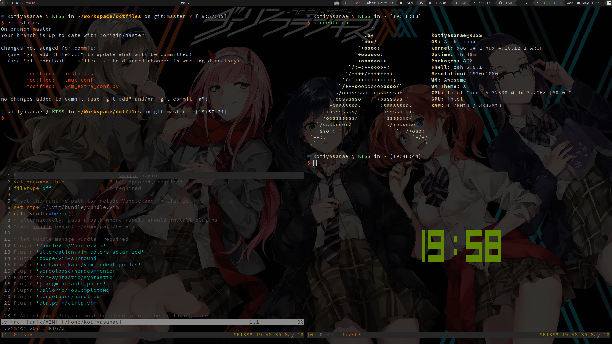

### Dotfiles
---
This repository hosts the dotfiles i use in my daily life. They should be cloned to your home directory, the path is `~/dotfiles/`.The script `install.sh` does two things:  
1. backup your config files(if exist) to `~/dotfiles_old`.
2. copy my config files for `awesomewm` & `tmux` & `vim` & `urxvt` & `zsh` to you.
### Before installation
---
- Before installation, `awesomewm` & `tmux` & `vim` & `rxvt-unicode` & `zsh` are supposed to be installed.
- Because i use **vundle** as the Vim plugin manager, you also need to install [Vundle](https://github.com/VundleVim/Vundle.vim).And vundle is an awesome plugin manager for Vim.(the `install.sh` will help you do this if you didn't)
- Set the default shell to **zsh** if it is not the current shell.You also need to install [oh-my-zsh](https://github.com/robbyrussell/oh-my-zsh) for your zsh's configuration.(the `install.sh` will help you do this if you didn't)
- The pkglist in the file is for backup my installed packages, you can ignore it.
### Installation
---
```bash
git clone https://github.com/Trytwice/dotfiles.git ~/dotfiles && cd ~/dotfiles && ./install.sh
```
### Customization
- **WallPaper**:The system's wallpaper is `~/.config/awesome/themes/powerarrow-dark/wall.png`, delete it and move you new wallpaper here and rename it as `wall.png`.
- **The music widget**:To use the music widget, you need install **mpd** and **mpc**.Search [ArchWiKi](https://wiki.archlinux.org/index.php/Music_Player_Daemon) for more details.
- **About NERDTree and ctrlp**:I map **F2** for NERDTreeToggle and **F3** for ctrlp, you can remap it whatever you want in `~/.vimrc` in the end of the file.
- **awesomewm and auto run app**:The default browser is firefox and you can change it in `~/.config/awesome/rc.lua` by the variable **browser**.When you start your system, urxvt will run in tag 1 with command -tmux, firefox will auto run in tag 2.The autorun app and command are set in the end of `rc.lua`.
###End
----
If you have any question, send me e-mail i will help you if i can.

